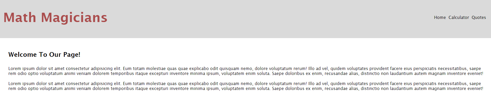

<!-- # Getting Started with Create React App -->
# Math magicians - Simple-Page Application 

## This is SPA project built in React. The web-site consist 3 pages: Home, Calculator and Quote. For styling of a project used `React basic styling`, and for navigation used `React Router`.
## [Live demo](https://elmar8287.github.io/react-math/).
## Heroku deployment [link](https://react-math-elmar8287.herokuapp.com/).

# Built With
- ReactJS
- JS 
- CSS
- Node.js 

# Getting Started

## Setup
- git clone https://github.com/elmar8287/react-math.git
- cd ./react-math

## Install
npm install

## Usage
npm start

## Build
npm run build

## Run tests
npm test

## Author

👤 **Elmar Abdulkarimov**

- GitHub: [@elmar8287](https://github.com/elmar8287)

## 🤝 Contributing

Contributions, issues, and feature requests are welcome!

Feel free to check the [issues page](../../issues/).

## Show your support

Give a ⭐️ if you like this project!

## Acknowledgments

The project personalized for my  purposes. See the MIT.md file

## 📝 License

This project is [MIT](./MIT.md) licensed.
